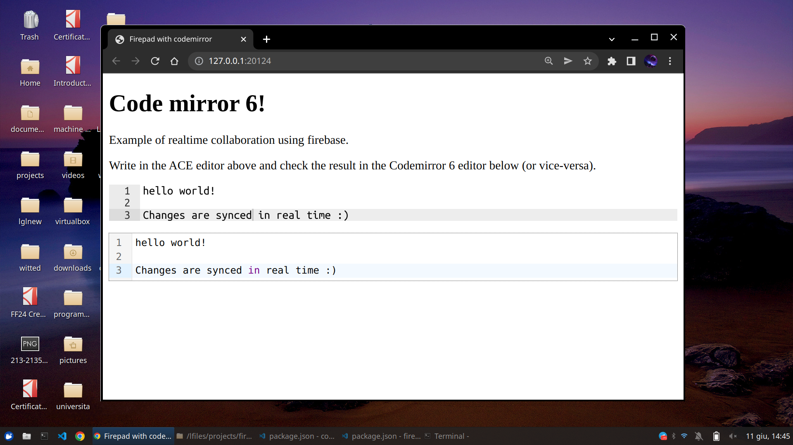

# Firepad examples

This folder includes some meaningful examples on how to configure and use Firepad.

Each example is a standalone html file that may be bundled as is with [Parcel](https://parceljs.org)

- [ace+codemirror6.html]() - basic Firepad setup with ACE and Codemirror6 editors
- [monaco.html]() - basic Firebase setup with Monaco editor
- work in progress!

